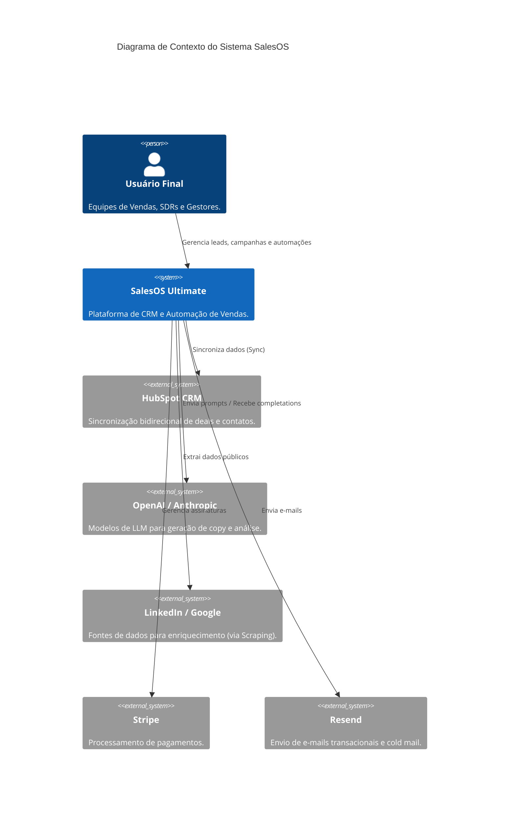
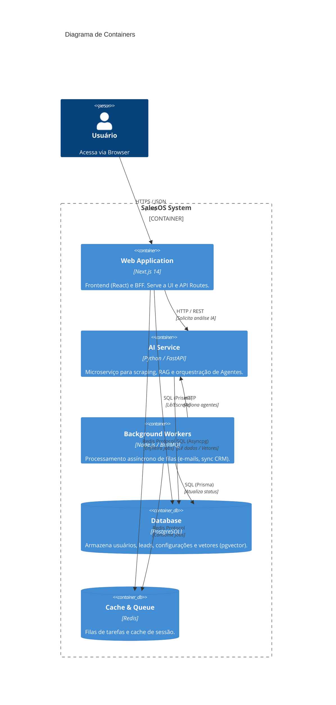
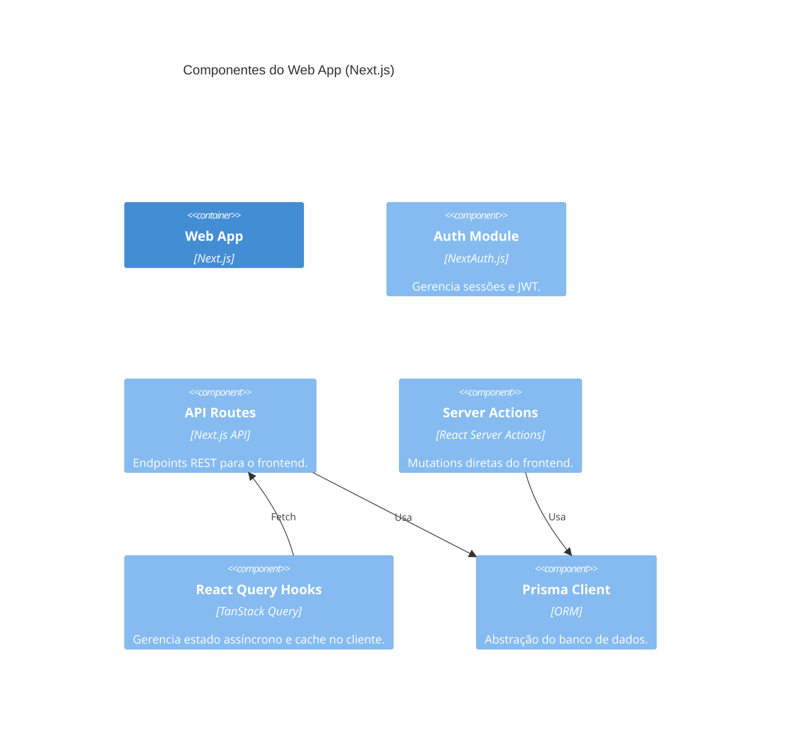

# Arquitetura C4 (Context, Containers, Components) 🏛️

Documentação visual da arquitetura do SalesOS Ultimate usando o modelo C4.

## Nível 1: Contexto

O diagrama de contexto mostra como o SalesOS se relaciona com o mundo exterior.

## Nível 2: Containers

O diagrama de containers mostra as aplicações e serviços executáveis.

## Nível 3: Componentes (Web App)

Visão interna do container `apps/web`.

## Decisões Arquiteturais

1. **Separação de Responsabilidades**:
   - **Node.js/Next.js**: Focado em I/O, UI e integrações rápidas.
   - **Python**: Focado em processamento pesado (CPU bound), manipulação de dados e bibliotecas de IA (LangChain, Pandas).

2. **Comunicação Assíncrona**:
   - Operações lentas (ex: "Enriquecer 1000 Leads") são enviadas para o Redis e processadas pelos Workers, liberando a UI imediatamente.

3. **Banco de Dados Compartilhado**:
   - O `ai-agents` acessa o mesmo banco PostgreSQL que o `web`. Isso evita a necessidade de duplicação de dados, mas exige cuidado com migrações (gerenciadas pelo Prisma no lado Node).
